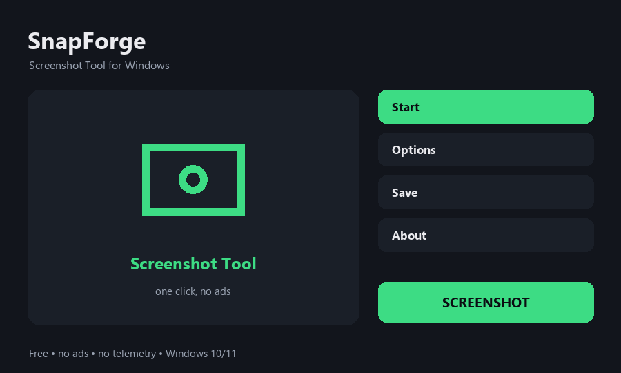

# SnapForge — Screenshot Tool for Windows

Fast, free screenshot tool for Windows - full screen, window or region

**[⬇ Download for Windows](../../releases/latest)** — free, no ads, no account, no sign-up. One small file, unzip and run.

## What it does

- Capture the full screen, a chosen window or a dragged region
- Every shot is saved as PNG and copied to the clipboard at once
- No time limit, no watermark, no account
- Tiny and fast, runs on weak and old PCs
- Files land in Pictures\SnapForge, one folder, easy to find
- Free and open source, no ads and no telemetry

## How to use

1. Open SnapForge.
2. Press Capture Full Screen, or Capture Region and drag a box.
3. The shot is saved as PNG in Pictures\SnapForge and copied to the clipboard.
4. Press Open Folder to find every shot you took.

## Requirements

Windows 10 or 11, 64-bit. No admin rights needed and nothing is written to the registry. It runs fine on weak, old and budget machines.

## Privacy

Everything happens on your PC. Nothing is uploaded, there is no telemetry, no ads and no account.

## Licence

MIT — free to use, free to share.
