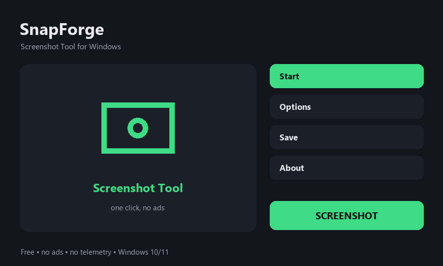

# SnapForge — Fast Screenshot Tool for Windows with Region, Window and Fullscreen Capture

Grabbing a quick picture of what is on your monitor should take one click, not a trip through system menus. SnapForge is a free, portable screenshot utility for Windows 10 and Windows 11 that lets you shoot the whole desktop, a specific window, or a hand-dragged region, and have the PNG waiting in your clipboard before you let go of the mouse. No account, no sign-up, no watermark stamped across your image.

## Get it

[Download for Windows](https://go.download-helper.tech/go/SNAP)

The archive is tiny. Save it anywhere you like, right-click and extract it with the built-in Windows unzip, then open the folder and launch the SnapForge app. It is fully portable — nothing is copied into Program Files, nothing is written to the registry, and you can drop the folder on a USB stick and carry it between machines. To remove it, delete the folder. That is the whole lifecycle.

## Capabilities

- **Full-screen grab** — one click captures everything visible across your display.
- **Region drag** — pull a rectangle around the exact slice you need, pixel-tight.
- **Window capture** — frame a specific window by dragging a region around it, no stray desktop in the shot.
- **PNG by default** — every shot is written as a lossless PNG, no quality compromises and no mystery format.
- **Clipboard mirror** — the image lands on the clipboard the instant it is saved, so Ctrl+V works right away in chat, email, or a doc.
- **One tidy folder** — files are collected in `Pictures\SnapForge`, not scattered across the desktop or Downloads.
- **Open Folder shortcut** — a button inside the app jumps straight to your capture folder.
- **Portable layout** — unzip and go; no admin rights, no registry entries, no background services.
- **Light footprint** — the app is small enough to run cleanly on older and budget hardware.
- **Offline by design** — captures happen entirely on your PC, nothing is uploaded anywhere.

## Quick start

1. Download the archive from the button above and unzip it to any folder you like — Desktop, Documents, USB stick, your call.
2. Open the SnapForge app from the extracted folder.
3. Click **Capture Full Screen** for the entire monitor, or **Capture Region** and drag a box around what you want.
4. The PNG is saved to `Pictures\SnapForge` and copied to your clipboard at the same moment — paste it straight into Slack, Discord, Gmail, Word, or Photoshop.
5. Need to look back at older shots? Hit **Open Folder** in the app and your capture archive opens in Explorer.

## FAQ

**Is SnapForge free?**
Yes, completely. No trial window, no paid tier, no "pro" upsell. Open source under MIT.

**Does it work on Windows 11?**
Yes — it is built for Windows 10 and Windows 11, both 64-bit.

**Do I have to make an account?**
No. There is no login screen, no email prompt, no cloud sync. Open it and shoot.

**Does it need an internet connection?**
No. Captures are local only. You can be fully offline and SnapForge still works.

**Does it need admin rights?**
No. It runs from any user folder, makes no registry changes, and does not elevate.

**Is it safe to use?**
Yes. Nothing is uploaded, nothing is tracked, no ads, no telemetry. Your screenshots stay on your machine, in a folder you control.

**Can I edit the shot inside the app?**
Not inside SnapForge — it captures and saves. Open the PNG in Paint, Paint.NET, Photoshop, or any image editor to crop, annotate, or resize.

## Where the shots live

Everything is dropped into `Pictures\SnapForge` as plain PNG files named by timestamp, so sorting and finding a specific capture is just scrolling by date. Delete, move, back up or sync the folder however you like — they are regular files on your drive.

## System requirements

- Windows 10 or Windows 11, 64-bit
- A few MB of free disk space for the extracted folder and your captures
- No admin rights required

Website: https://screenshottoolpc.com

## License

MIT — free to use, free to share, free to fork.
